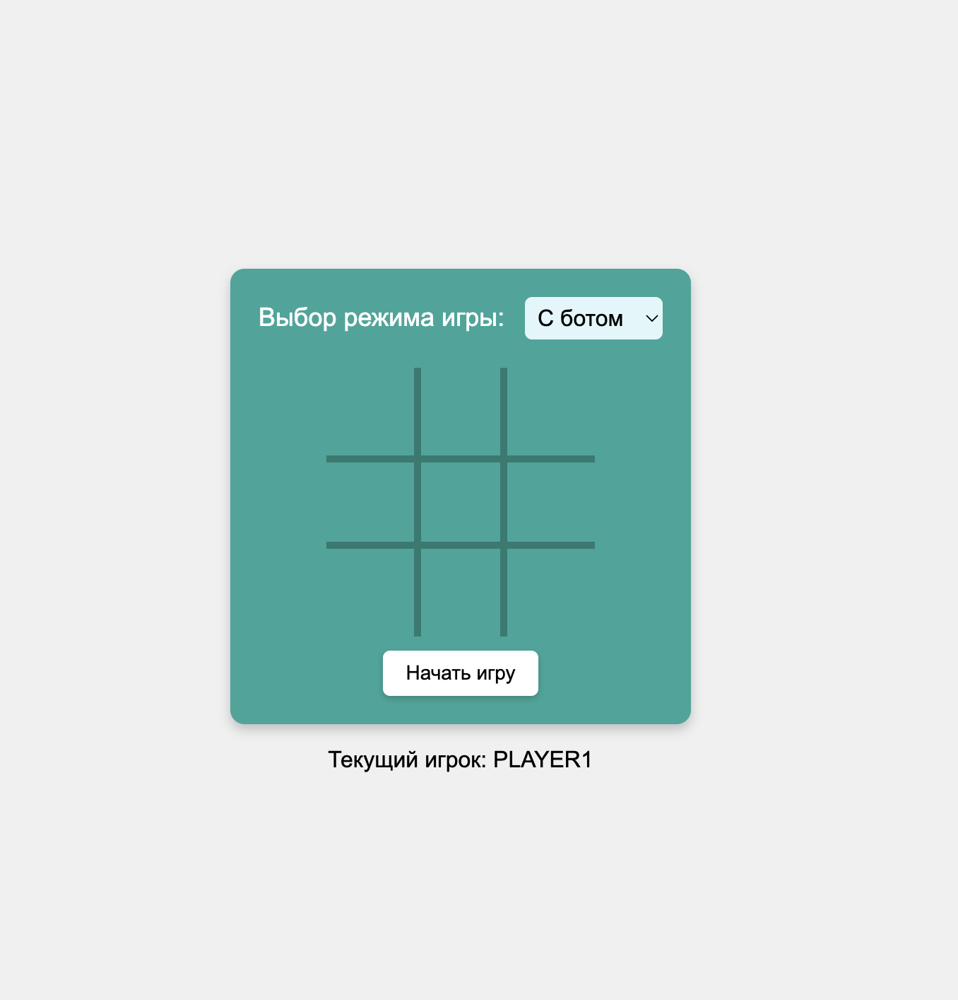
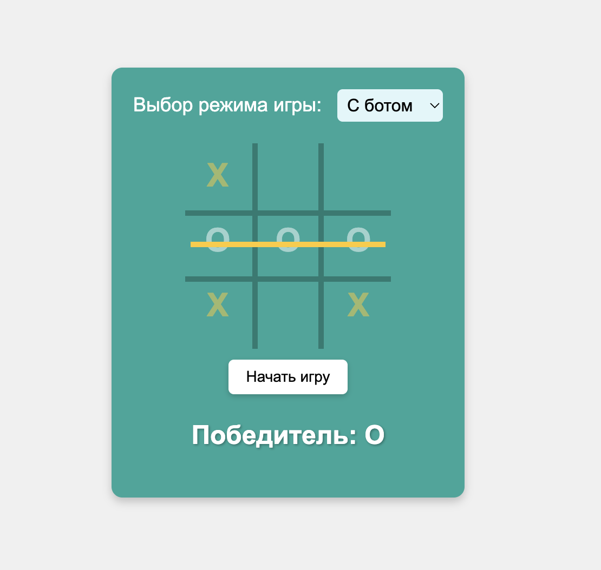

# Крестики-Нолики (Tic-Tac-Toe) на Spring



## Описание проекта
Проект представляет собой веб-приложение для игры в крестики-нолики, реализованное с использованием Spring Framework. Приложение поддерживает одновременное проведение нескольких игр, валидацию ходов и "умный" ответ компьютера с использованием алгоритма Минимакс.

## Структура проекта
Проект организован по многослойной архитектуре:

```
src/main/java/com/tictactoe/
├── datasource/            - Слой работы с данными
│   ├── mapper/           - Мапперы данных
│   ├── model/            - Модели данных
│   ├── repository/       - Репозитории хранения
│
├── di/                   - Конфигурация зависимостей
│   └── ProjectConfig.java - Основная конфигурация Spring
│   └── aspects/          - Аспекты (дополнительная функциональность)
├── domain/               - Бизнес-логика
│   ├── bot/              - Логика бота
│   ├── model/            - Доменные модели
│   ├── player/           - Логика игрока
│   ├── service/          - Сервисный слой 
│   └── utils/            - Вспомогательные утилиты
│
├── web/                  - Веб-слой
│   ├── controller/       - Контроллеры API
│   ├── mapper/           - Мапперы DTO
│   ├── model/            - DTO модели
│   └── WebService.java   - Веб-сервис
│
└── TictactoeApplication.java - Главный класс Spring Boot
```

## Функциональность
- Создание новой игры с уникальным UUID
- Поддержка нескольких одновременных игр
- Валидация ходов пользователя
- "Умный" ход компьютера с использованием алгоритма Минимакс
- Проверка состояния игры (победа, поражение, ничья)
- REST API для взаимодействия с игрой

## Технологии
- Java 18
- Spring Framework
- Gradle (Kotlin DSL)
- Алгоритм Минимакс для AI

## API Endpoints

### 1. Запуск новой игры
**Endpoint:** `POST /start`

**Параметры:**
- `gameMode` (обязательный) - режим игры, принимает значения:
  - `PvB` - игра против компьютера

**Описание:**
Инициализирует новую игровую сессию с выбранным режимом. Возвращает начальное состояние игры.

**Пример запроса:**
```http
POST /start?gameMode=PvP
```

**Особенности:**
- Использует аннотацию `@ToLog` для логирования вызовов
- Создает новый экземпляр `WebService` для обработки запроса
- Возвращает модель `WebModel` с состоянием игры

### 2. Совершение хода
**Endpoint:** `POST /move`

**Параметры:**
- Тело запроса (`WebModel`):
  - `gameId` - идентификатор игры
  - `board` - текущее состояние доски
  - `gameMode` - режим игры
  - `playerType` - тип игрока
  - `winner` - результат игры
- `row` (обязательный) - номер строки (0-2)
- `column` (обязательный) - номер столбца (0-2)

**Описание:**
Обрабатывает ход игрока и возвращает обновленное состояние игры. В режиме против компьютера автоматически выполняет ответный ход.

**Особенности:**
- Валидирует корректность хода (свободна ли клетка, правильный ли игрок ходит)
- В режиме PvB автоматически выполняет ход компьютера
- Использует `@ToLog` для логирования
- Возвращает обновленное состояние игры или сообщение об ошибке

**Ошибки:**
- `400 Bad Request` - некорректные параметры хода
- `404 Not Found` - игра не найдена

Оба endpoint'а используют сервисный слой (`gameService`) для выполнения бизнес-логики и возвращают данные в формате, удобном для веб-интерфейса (`WebModel`).

## Запуск проекта
1. Убедитесь, что установлена JDK 18
2. Клонируйте репозиторий
3. Запустите TictactoeApplication.java


## Особенности реализации
- Потокобезопасное хранение игр с использованием concurrent коллекций
- Разделение моделей для каждого слоя (web, domain, datasource)
- Использование мапперов для преобразования между слоями
- Алгоритм Минимакс для оптимального хода компьютера